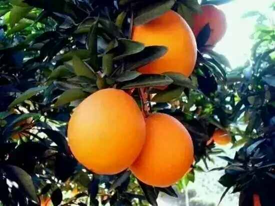
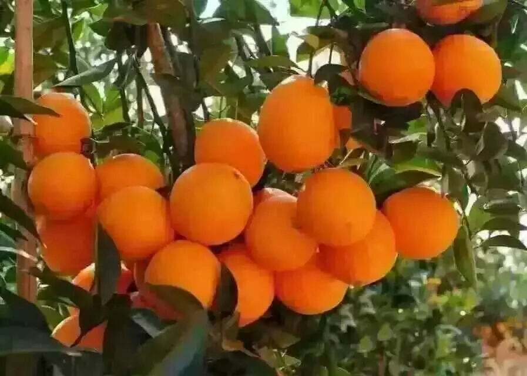
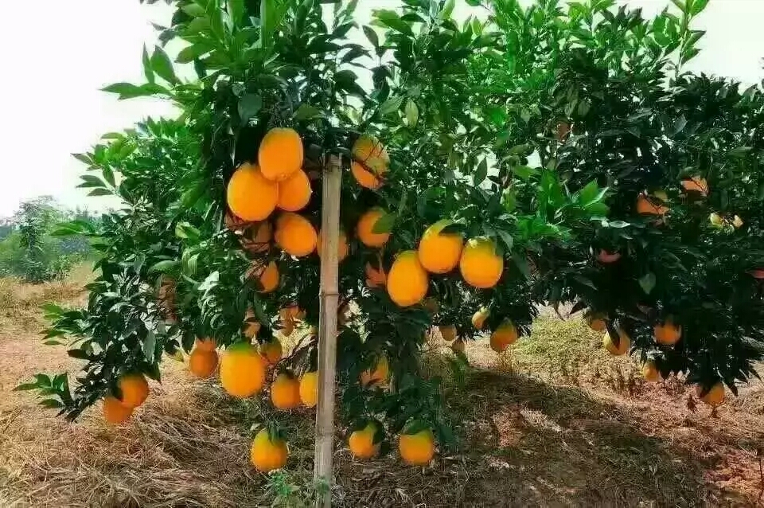

## 脐橙介绍 ##

&nbsp;&nbsp;农村老家种的脐橙（产地湖南邵阳），不催熟，不打蜡，不打甜蜜素，汁水饱满，自然甘甜，真正的原生态食品，10斤装 50元包邮，20斤装98元包邮。

## 联系方式 ##

&nbsp;&nbsp;**联系人：**田女士 
&nbsp;&nbsp;**联系电话：**18501373836 
&nbsp;&nbsp;**微信号：**tianboyuan1207(长按下面的二维码图片即可添加) 

## 脐橙图片: ##

## 这里统一回复一下大家关心的一些问题： ##

问：是打蜡的吗？ 
答：树上刚采摘的，没有打蜡，原滋原味。

问：甜吗？ 
答：自然熟的脐橙相比市面上的没有那么甜，这就是自然熟的味道，如果喜欢吃甜的，那您还是购买市面上的吧

问：水足吗? 
答：南方雨水多，所以果实水分还是很足的，请放心。

问：多久能到货？ 
答：正常的3-6天到货，下单后第二天发货。
