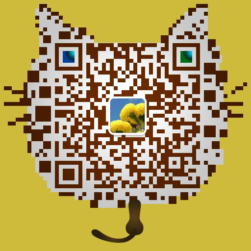
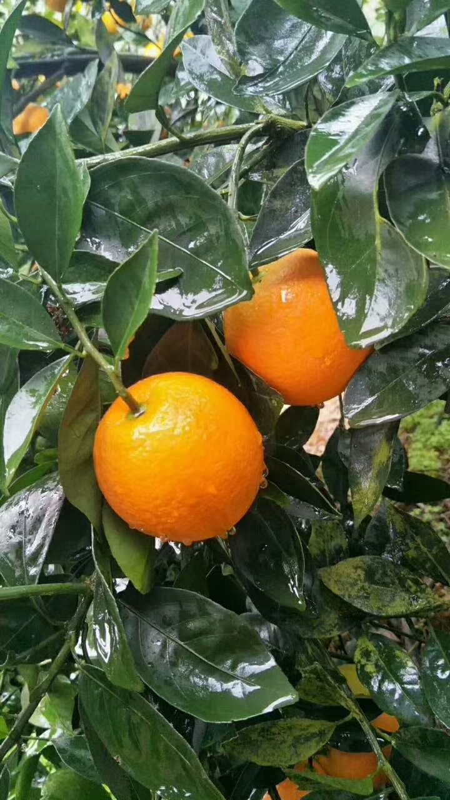
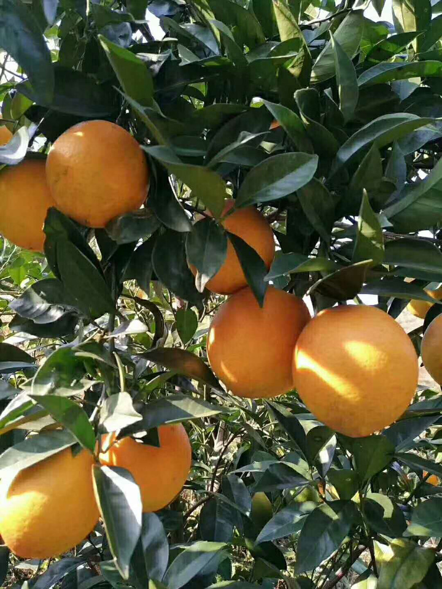
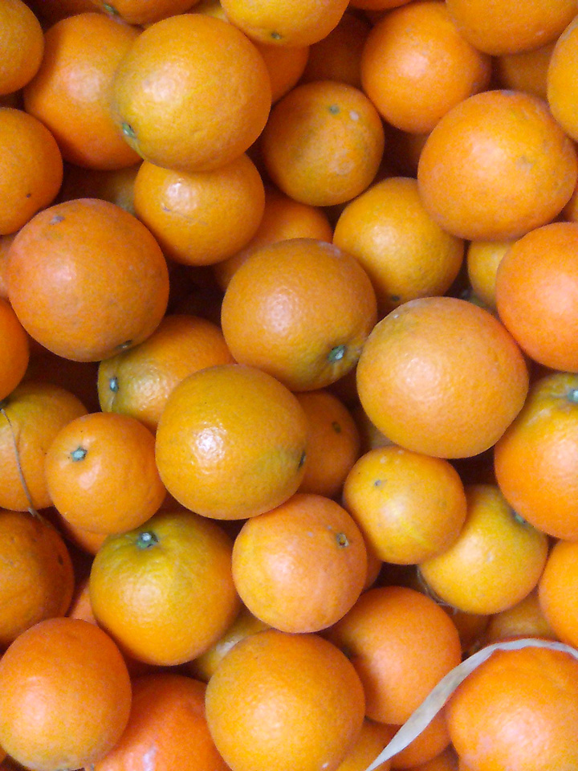

&nbsp;&nbsp;&nbsp;&nbsp;
农村老家种的脐橙（产地湖南省新宁县清江桥乡），自家种植，现摘现卖，农家肥，自然成熟，不打蜡，新鲜美味，欢迎购买与品尝。

招牌黄橙10斤装 68元包邮，20斤装128元包邮;
 
新版红心橙10斤装 88元包邮，20斤装 168元包邮。

联系人：田女士 
联系电话：18501373836 
微信号：tianboyuan1207 (长按下面的二维码图片后点击“识别图中二维码”也可以添加)

<h2 style="text-align:center;"> 脐橙图片 </h2>

<h2 style="text-align:center;"> 脐橙介绍 </h2>

 &nbsp;&nbsp;&nbsp;&nbsp;新宁县气候温润温和，无霜期长，光照充足。境内群山环绕，森林密布，水系发达，河道纵横。土壤富含各种有益人体健康的微量元素。空气清新，四季分明，无工业“三废”污染，是生产绿色食品的理想区域，适宜种植脐橙的土地面积3万公顷，是国家外贸部和农业部联合批准的全国四大脐橙出口基地县之一，列入国家柑橘优势产业带脐橙生产重点县。 近年来，新宁县始终坚持科学发展、绿色发展、创新发展，紧紧围绕农业增效，农民增收的目标，把发展脐橙产业作为推进精准扶贫和农业现代化的一篇大文章来做，在全县深入开展脐橙基地建设和“补天窗”工程、种苗工程、优果工程、贮藏保鲜工程、信息网络工程、果农素质提升工程“六大工程”建设，经过多年的快速发展，现已形成总面积30万亩，年产20万吨，产值过5亿元的产业规模。 新宁脐橙，色泽橙红，果面细腻；风味浓甜，汁胞细嫩，富有香气，品质上等，鲜食极佳；耐贮藏运输，货架寿命长，产品在常温下贮藏到第二年四月而风味不减；营养丰富，具保健作用，能软化血管，增强心脑机能，并可预防癌症、中风、糖尿病和其它慢性病。新宁脐橙先后通过国家无公害农产品、绿色食品认证和地理标志保护认证，多次获国家农业部、湖南省优质农产品金奖和“湖南名牌农产品”，产品畅销国内外各大市场，并出口东南亚、加拿大、美国、欧盟、俄罗斯等40多个国家和地区。

<h2 style="text-align:center;">这里统一回复一下大家关心的一些问题</h2>

问：是打蜡的吗？ 
答：树上刚采摘的，没有打蜡，原滋原味。
 
 
问：甜吗？ 
答：纯正的甜味。
 
 
问：水足吗? 
答：南方雨水多，所以果实水分还是很足的，请放心。
 
 
问：你的果子是一点农药都不打吗？ 
答：这个是做不到的，我们果子成长过程药物的使用就跟小孩打的预防针，不然树都没了，但是我们绝对保证果子不打甜蜜素，不上催熟剂，不打蜡。
 
 
问：多久能到货？ 
答：正常的3-6天到货，下单后第二天发货。
 
 
问：是包邮价吗？ 
答：是的，全国包邮。

